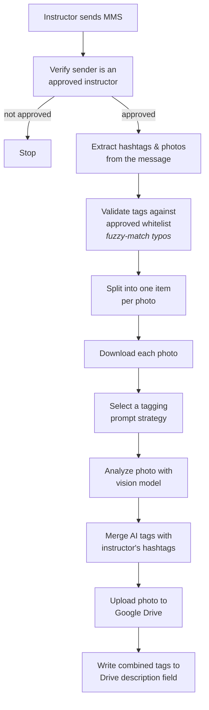

# Ski School MMS Photo Pipeline

An n8n workflow that turns a text message into a tagged, searchable photo
library. A ski instructor texts a few photos with hashtags after a
lesson; the pipeline verifies the sender, validates their tags against an
approved taxonomy, analyzes each photo with a vision model, and uploads
the results to Google Drive with a searchable, tag-rich description.

Built to solve a real problem for a ski school. Instructors needed a fast
way to get lesson photos into a shared library that's actually organized
and searchable by activity, location, and photo quality, without asking
non-technical instructors to do anything more than send an MMS.

## What it does

1. **Verifies the sender.** Checks the incoming phone number against an
   approved instructor list in Google Sheets.
2. **Validates tags.** Extracts hashtags from the message and matches
   them against an approved tag whitelist, using fuzzy matching to catch
   likely typos (`#silverfirchair` maps to `silver_fir_chair`).
3. **Analyzes each photo.** Sends each attached photo to a vision model
   (GPT-4o-mini) with a configurable prompt strategy, generating
   additional descriptive tags beyond what the instructor typed.
4. **Flags standout photos.** The model also applies a `hero_shot` tag
   to photos strong enough for marketing use (website, Instagram,
   newsletters), reusing the same tag pipeline rather than a separate
   classification step.
5. **Uploads and describes.** Uploads each photo to Google Drive and
   writes the combined tag list into the file's description field, so
   staff can search the library by tag.

## Architecture



This diagram shows the conceptual flow. The actual n8n workflow includes
several additional utility nodes (Merge and Set nodes used to recombine
data across parallel branches) that aren't shown here for clarity. See
`workflow/ski-photo-pipeline.json` for the complete, exact node graph.

## Repository structure

```
├── workflow/
│   └── ski-photo-pipeline.json   Full n8n workflow export (sanitized)
├── prompts/                      Each vision-model prompt, standalone
│   ├── whitelist_only.md
│   ├── ski_relevant.md
│   ├── unrestricted.md
│   └── quality_check.md
├── python/                       Each Code node's logic, standalone
│   ├── check_instructor.py
│   ├── parse_message.py
│   ├── validate_tags.py
│   ├── create_prompt.py
│   └── merge_tags.py
├── images/                       Sample input photos + pipeline output
│   ├── README.md                 Attribution & output notes
│   └── outputs/                  Sample final metadata per photo
└── data/                         Representative sample data
    ├── README.md
    ├── sample_tags_whitelist.csv
    └── sample_instructors.csv
```

The `prompts/` and `python/` folders exist so each piece can be read on
its own, without opening n8n or digging through the workflow JSON. The
`create_prompt.py` file (in `python/`) contains the same prompt text
embedded in the selection logic; the standalone files in `prompts/` are
there purely for quick, isolated review.

`images/` and `data/` make the pipeline's real behavior reviewable
without running n8n at all: sample photos, the metadata the pipeline
actually produced for each one, and representative versions of the two
Google Sheets the workflow depends on.

## Design notes

**MMS trigger.** Built for Twilio's MMS webhook format. No live Twilio
number is connected here. The trigger node uses pinned sample data in
the same shape, so the workflow can be reviewed and run without a live
account.

**Python runs in a separate container.** n8n's official Docker image
doesn't include Python. Rather than install it into that image, this
workflow uses n8n's built-in external task runner setup, a small
separate container that runs the Python code and reports back to the
main n8n container. This is n8n's documented way to run Python, not a
workaround.

**Some nodes reference earlier nodes directly, others use a Merge
node.** n8n's expressions can reach back to any earlier node's data.
Python code can't, it only sees what's connected directly into it.
Where a Python node needs data from earlier in the flow, that data is
either carried forward through the chain or combined in with a Merge
node.

**Tag validation.** Instructors type a few hashtags, and typos happen.
A fuzzy-matching step catches likely misspellings (like
`#silverfirchair`) and maps them to the correct approved tag instead of
dropping them.

**Three tagging prompts, three different jobs:**
- `whitelist_only`: only use approved tags
- `ski_relevant`: open-ended, but scoped to what's relevant to a ski school
- `unrestricted`: no scoping, mainly useful for testing

## License

The code in this repository (workflow JSON, Python, and prompts) is
available under the [MIT License](LICENSE).

Sample photos in `images/` are sourced from Unsplash and are covered by
the separate [Unsplash License](https://unsplash.com/license), not the
MIT license above. See `images/README.md` for full attribution.

## What I'd add next

- **Wire in `quality_check`** as a real pre-upload gate (drafted, not
  yet connected). Run it as a parallel vision call, then branch on
  `pass`/`fail` with an IF node before the Drive upload.
- **A caption-generation prompt.** Drafted during development, then
  descoped to keep the core tagging pipeline focused and reviewable.
- **A privacy-flag prompt.** Flagging photos with clearly identifiable
  minors' faces, for a human review step before any public use.
